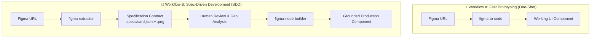

# Skills

A curated collection of modular, production-ready skills developed for AI coding agents (such as Claude Code, OpenCode, Codex, Google Antigravity, and Cursor).

Each skill in this repository is designed to give AI assistants specialized, autonomous capabilities while maintaining:
- **Token Efficiency**: Pruning unnecessary data and noise to keep agent context windows lean and fast.
- **Zero or Minimal Dependencies**: Standalone scripts that execute on demand without fragile background daemons.
- **Domain Intelligence**: Structured, context-aware outputs (such as resolved design tokens and component props) that allow agents to generate production-quality code.

---

## Available Skills

| Skill | Role / Workflow | Description | Links |
| :--- | :--- | :--- | :--- |
| **[`figma-to-code`](./figma-to-code)** | **One-Shot / Fast Prototyping** | Direct, single-turn conversion of Figma designs into clean, production-ready UI components. Best for rapid prototyping and standalone components. | [Guide](./figma-to-code/README.md) · [`SKILL.md`](./figma-to-code/SKILL.md) |
| **[`figma-extractor`](./figma-extractor)** | **SDD Step 1 (Ingest)** | Pure specification scraper that pulls compact layout trees, design tokens, and rendered preview images into `./.specs/`. Never touches application code. | [Guide](./figma-extractor/README.md) · [`SKILL.md`](./figma-extractor/SKILL.md) |
| **[`figma-node-builder`](./figma-node-builder)** | **SDD Step 2 (Implement)** | Grounded UI builder that reads extracted Figma Node specifications (`.specs/*.json`) and preview images (`*.png`) to build components without CSS hallucinations. | [Guide](./figma-node-builder/README.md) · [`SKILL.md`](./figma-node-builder/SKILL.md) |

---

## Two Supported Workflows



* **Use `figma-to-code`** when you want fast execution: you provide a Figma URL, and the agent extracts and writes the component in one turn.
* **Use `figma-extractor` + `figma-node-builder`** in formal Spec-Driven Development (SDD): the design specification is extracted to disk first, reviewed/approved, and then systematically implemented into your design system without premature code edits.

---

## Quick Install via `npx`

Install any or all skills into your favorite AI coding assistant with a single interactive command:

```bash
npx github:pedroab0/skills
```

The installer features a clean, interactive terminal UI:
* **Navigate**: Use keyboard arrows (`↑` / `↓`) or vim keys (`k` / `j`) to move between options.
* **Select**: Press `[Enter]` or press number keys (`1` - `5`) to select directly.
* **Exit**: Press `[ESC]` or `q` at any time to cancel cleanly.

### Selection Options & Presets

1. **All skills** `[Enter / 1]`: Installs `figma-to-code`, `figma-extractor`, and `figma-node-builder` (recommended).
2. **figma-extractor and figma-node-builder** `[2]`: Spec-Driven Development (SDD) Suite.
3. **figma-to-code** `[3]`: Fast prototyping (URL ──► UI Code).
4. **figma-extractor** `[4]`: Figma design scraper (extracts layout AST, tokens & preview images to `.specs/`).
5. **figma-node-builder** `[5]`: Builds UI components from extracted Figma JSON specs (`.specs/*.json`).

Or specify flags for fast, non-interactive setup:
```bash
# Install all skills for Claude Code globally
npx github:pedroab0/skills --agent claude --skill all

# Install SDD skills for Google Antigravity
npx github:pedroab0/skills --agent antigravity --skill figma-extractor,figma-node-builder

# Install one-shot coder for Cursor (.cursor/rules)
npx github:pedroab0/skills --agent cursor --skill figma-to-code
```

---

## Manual Installation Guide

If you prefer to install manually, all skills follow the open Agent Skills standard (`SKILL.md` format):

### 1. Claude Code

Claude Code supports skills both locally within a repository or globally across your user profile.

- **Global Installation (All Projects)**:
  ```bash
  mkdir -p ~/.claude/skills
  ln -s /path/to/skills/figma-to-code ~/.claude/skills/figma-to-code
  ln -s /path/to/skills/figma-extractor ~/.claude/skills/figma-extractor
  ln -s /path/to/skills/figma-node-builder ~/.claude/skills/figma-node-builder
  ```

- **Usage & Activation**:
  - **Automatic**: Claude Code inspects `SKILL.md` descriptions on startup and loads the appropriate skill automatically based on your prompt.
  - **Manual Slash Command**: Run `/figma-to-code <FigmaURL>` or `/figma-extractor <FigmaURL>` directly in the chat.

---

### 2. OpenCode

OpenCode discovers skills from project or user configuration directories, maintaining full compatibility with the open `SKILL.md` standard.

- **Global Installation (All Projects)**:
  ```bash
  mkdir -p ~/.config/opencode/skills
  ln -s /path/to/skills/figma-to-code ~/.config/opencode/skills/figma-to-code
  ln -s /path/to/skills/figma-extractor ~/.config/opencode/skills/figma-extractor
  ln -s /path/to/skills/figma-node-builder ~/.config/opencode/skills/figma-node-builder
  ```

---

### 3. Cursor

In Cursor, reference skills via `.cursor/rules/` or mention them in Composer chat:
* To extract specs: prompt `@figma-extractor extract this frame: <url>`.
* To implement a spec: prompt `@figma-node-builder implement .specs/card.json`.

---

### 4. Google Antigravity / Gemini CLI

Symlink or copy the skills into your Antigravity skills directory:
```bash
ln -s /path/to/skills/figma-to-code ~/.gemini/antigravity-cli/skills/figma-to-code
ln -s /path/to/skills/figma-extractor ~/.gemini/antigravity-cli/skills/figma-extractor
ln -s /path/to/skills/figma-node-builder ~/.gemini/antigravity-cli/skills/figma-node-builder
```

---

## Repository Structure

```text
skills/
├── README.md                 # Curated skills repository catalog (this file)
├── figma-to-code/            # Direct one-shot Figma to UI code generator
│   ├── SKILL.md              # One-shot agent skill definition
│   ├── README.md             # One-shot documentation & flags
│   └── scripts/              # Extraction scripts & test suite
├── figma-extractor/          # SDD Step 1: Pure Figma design specification scraper
│   ├── SKILL.md              # Pure scraper skill definition (outputs to .specs/)
│   ├── README.md             # In-depth scraper documentation & flags
│   └── scripts/              # Standalone Node.js extraction scripts & tests
└── figma-node-builder/       # SDD Step 2: Spec-driven UI component builder
    ├── SKILL.md              # 4-Phase SDD implementation skill definition
    ├── README.md             # In-depth builder documentation
    └── scripts/              # Spec inspector CLI & test suite
```

---

## Adding New Skills

When adding new skills to this curation:
1. Create a dedicated directory: `<skill-name>/`
2. Include a `SKILL.md` with standard YAML frontmatter (`name`, `description`) and agent instructions.
3. Provide a `README.md` with detailed skill-specific documentation and manual execution flags.
4. Keep scripts self-contained with minimal external dependencies.
5. Update this root `README.md` catalog to list the new skill.
