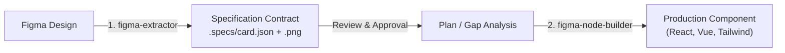

# Figma Node Builder

An AI coding agent skill that synthesizes extracted Figma Node specifications (`.specs/*.json`) and rendered preview images (`.specs/*.png`) into production-grade, grounded UI components.

This skill serves as the **Implementation Layer (Step 2)** in a **Spec-Driven Development (SDD)** workflow.

---

## Why Spec-Driven UI Building?

In traditional AI coding, developers often ask an LLM to build a component with only a screenshot or a raw Figma URL. The model guesses paddings, hallucinates arbitrary hex codes, builds nested `<div>` soup, and recreates components that already exist in your codebase.

**`figma-node-builder` fixes this by grounding the AI in a formal specification contract**:

| Traditional Vibe Coding | Spec-Driven with `figma-node-builder` |
| :--- | :--- |
| Guesses random spacing (`padding: 23px`) | Uses exact resolved tokens (`spacing/md` $\rightarrow$ `p-4`) |
| Guesses arbitrary hex codes (`#1f2937`) | Maps to semantic tokens (`colors/brand/primary`) or CSS variables |
| Re-invents existing buttons as raw `<div>`s | Inspects your codebase and renders `<Button variant="outline" />` |
| Requires Figma API access & credentials | **100% offline**: runs directly on local `.specs/` files |
| No automated visual verification | Compares rendered DOM against `.specs/<name>.png` |

---

## How It Fits into SDD



1. **Step 1 (Ingest)**: Design specifications are extracted into `./.specs/card.json` (and optional companion `./.specs/card.png`) using either [`figma-extractor`](../figma-extractor) (CLI / API) or the **Figma Node JSON Extractor** (Figma Desktop plugin).
2. **Review**: The human developer or architect reviews the tokens, components, and layout bounds.
3. **Step 2 (Build)**: **`figma-node-builder`** is invoked to build the component in your project.

---

## The 4-Phase Protocol

When invoked, the agent systematically executes four phases:

### Phase 1: Codebase Discovery
* Scans `package.json` to detect your framework (React, Vue, Svelte, Next.js, HTML/CSS).
* Scans `components/` or `src/components/` for existing design system primitives (`Button`, `Input`, `Card`, `Badge`).
* Inspects `tailwind.config.js` or CSS variables to discover configured design tokens.

### Phase 2: Gap Analysis & Token Mapping
* Analyzes the `.specs/<name>.json` AST.
* Pairs Figma component instances (`INSTANCE`) to your codebase components and maps their variant props.
* Maps Figma design tokens (`spacing/md`, `colors/brand/primary`) to your project's styling system.
* Identifies any missing primitives that need to be scaffolded.

### Phase 3: Grounded Code Synthesis
* Translates Auto-layout (`HORIZONTAL`, `VERTICAL`) directly into Flexbox (`flex-row`, `flex-col`, `gap`).
* Replaces component instances with direct component imports (no `<div>` soup).
* Applies semantic design tokens instead of hardcoded numbers.

### Phase 4: Visual Cross-Check
* Inspects the companion `.specs/<name>.png` visual reference.
* Cross-checks margins, alignments, typography scales, and responsive wrapping.

---

## How to Use the Skill

Simply prompt your AI coding assistant (Claude Code, Cursor, OpenCode, Codex, or Antigravity):

```text
"Build the component from .specs/transaction-card.json using .specs/transaction-card.png as visual reference"
```

Or in an automated SDD flow after running `figma-extractor`:
```text
"Spec extracted to .specs/card.json. Proceed with implementation using figma-node-builder."
```

---

## Supported Stacks

Because `figma-node-builder` inspects your project dynamically during Phase 1, it works across any modern frontend stack:
* **Frameworks**: React, Next.js, Vue, Nuxt, Svelte, SvelteKit, Astro, Solid, plain HTML/CSS.
* **Styling**: Tailwind CSS, CSS Modules, Styled Components, Emotion, Vanilla CSS.
* **Component Libraries**: shadcn/ui, Radix UI, Headless UI, Material UI, Chakra UI, or completely custom design systems.

---

## Spec Inspector CLI

`figma-node-builder` includes a zero-dependency companion inspector tool to quickly analyze any specification file without loading raw JSON into agent context:

```bash
# Terminal report (dimensions, layout mode, tokens, components, checklist)
node figma-node-builder/scripts/inspect_spec.js .specs/card.json
# (or with shorthand name)
node figma-node-builder/scripts/inspect_spec.js card

# Output clean Markdown tables for implementation plans & walkthroughs
node figma-node-builder/scripts/inspect_spec.js card --markdown

# Output structured JSON
node figma-node-builder/scripts/inspect_spec.js card --json
```
