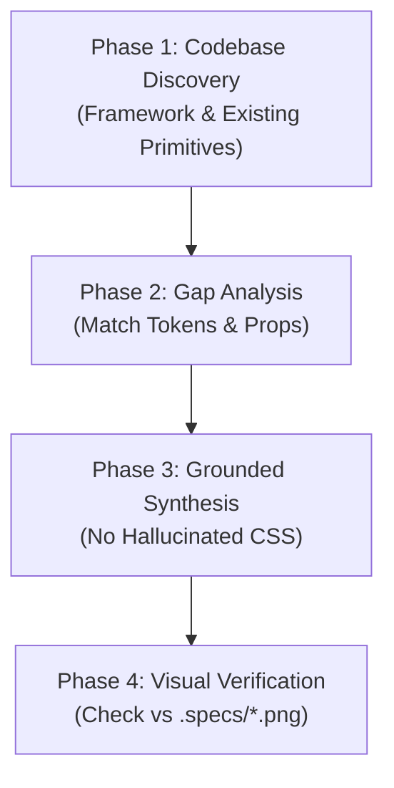

# Figma Node Builder Skill (SDD Implementation Layer)

Build production-grade, design-system-grounded UI components directly from extracted Figma Node trees (`.specs/<name>.json`) and visual reference images (`.specs/<name>.png`).

This skill serves as the **Implementation Layer** in a **Spec-Driven Development (SDD)** workflow. It works entirely offline and locally from the extracted specification contract—no Figma API calls or tokens required.

---

## When to Trigger This Skill

Trigger this skill whenever:
* The user references an existing specification file (e.g., *"Build the component from `.specs/card.json`"*).
* An extraction step by `figma-extractor` or the **Figma Node JSON Extractor** plugin has completed, and the user approves the implementation (e.g., *"Proceed"*, *"Build it"*, *"Implement the UI"*).
* The user asks to turn a local Figma node AST (`.specs/<name>.json`) into React, Vue, Svelte, or HTML/CSS code.

---

## The 4-Phase Implementation Protocol



### Phase 1: Codebase Discovery
Before writing any code, inspect the host project to ground your implementation:
1. **Framework & Styling**: Check `package.json` for React, Vue, Svelte, Next.js, Tailwind CSS, styled-components, or plain CSS.
2. **Existing UI Primitives**: Inspect `components/ui/`, `src/components/`, or design system libraries (e.g., shadcn/ui, Radix, MUI) to identify reusable components (`Button`, `Input`, `Card`, `Badge`).
3. **Design Token System**: Inspect `tailwind.config.js`, `theme.css`, or `globals.css` to see how colors and spacing scales are configured.

### Phase 2: Gap Analysis & Token Mapping
Analyze the input JSON spec (`.specs/<name>.json`).

> **Tip**: Instead of reading the entire raw JSON AST into your context window, run the companion **Spec Inspector CLI** to get a compact summary:
> ```bash
> # Global Antigravity install:
> node ~/.gemini/config/skills/figma-node-builder/scripts/inspect_spec.js .specs/<name>.json
> # Or project local install:
> node figma-node-builder/scripts/inspect_spec.js .specs/<name>.json
> # Output Markdown directly for your implementation plan:
> node <skill-dir>/scripts/inspect_spec.js .specs/<name>.json --markdown
> ```

* **Component Instances**: For each node with `type: "INSTANCE"`, match `component.name` against existing codebase components. Extract its `props` (e.g., `{ variant: "outline", size: "lg", hasIcon: true }`).
* **Design Tokens**: For every `token` property (e.g., `colors/brand/primary`, `spacing/md`, `radii/lg`), map to the project's CSS variables (`var(--color-brand-primary)`) or Tailwind classes (`bg-brand-primary`, `p-4`, `rounded-lg`).
* **Gaps**: Identify any sub-components that do not exist yet in the codebase and plan to scaffold them.

### Phase 3: Grounded Code Synthesis
Generate component code strictly adhering to the node specification:

1. **Reusing Existing Components (Anti-Div Soup Rule)**:
   - When an `INSTANCE` node matches an existing component, **import and render it directly**:
     ```tsx
     // Correct:
     <Button variant="primary" size="large" hasIcon>Confirm Order</Button>

     // Forbidden (do not rebuild existing primitives from raw divs):
     <div className="flex bg-blue-500 rounded p-2 text-white">Confirm Order</div>
     ```
2. **Layout & Flexbox Translation**:
   - `layoutMode: "HORIZONTAL"` $\rightarrow$ Flex row (`display: flex; flex-direction: row;` or `flex flex-row`).
   - `layoutMode: "VERTICAL"` $\rightarrow$ Flex column (`display: flex; flex-direction: column;` or `flex flex-col`).
   - `itemSpacing` $\rightarrow$ CSS `gap` (map to `itemSpacingToken` if available).
   - `padding` $\rightarrow$ CSS `padding` (map to `paddingToken` if available).
   - `primaryAxisAlignItems` / `counterAxisAlignItems` $\rightarrow$ `justify-*` and `items-*`.
3. **Typography & Colors**:
   - Never guess hex colors. If `token` is present, use the semantic token. If not, use the fallback `color` hex string.
   - Map font sizes, font weights, and line heights to existing design tokens or typography classes.

### Phase 4: Visual Cross-Check & Verification
* **Optional Companion Image**: If the companion preview image (`.specs/<name>.png`) exists, inspect it to cross-check visual styling and icons.
* **AST-Only Synthesis**: If `.specs/<name>.png` was omitted (to conserve Tier 1 API calls), rely strictly on the exact metrics, flexbox rules, hex colors, and font styles in `.specs/<name>.json`.
* If a dev server or browser preview is active, verify that the rendered DOM matches the specification.

---

## Input Spec Reference (Figma Node AST)

The input `.specs/<name>.json` file contains a pruned AST of Figma nodes:

| Field | Meaning | Code Mapping |
| :--- | :--- | :--- |
| `type` | Node type (`FRAME`, `INSTANCE`, `TEXT`, `VECTOR`) | Container (`div` / `section`), Component import, or Typography tag (`h1`-`p`). |
| `layoutMode` | Auto-layout direction (`HORIZONTAL`, `VERTICAL`) | `flex flex-row` or `flex flex-col`. |
| `itemSpacing` / `itemSpacingToken` | Gap between child items | `gap-*` class or `gap: Xpx`. |
| `padding` / `paddingToken` | Object with `top`, `right`, `bottom`, `left` | `p-*`, `px-*`, `py-*` classes or `padding: ...`. |
| `cornerRadius` / `cornerRadiusToken` | Border radius | `rounded-*` class or `border-radius: Xpx`. |
| `component.name` | Master component name for an `INSTANCE` | Import name (e.g. `import { Button } from '@/components/ui/button'`). |
| `props` | Normalized component variant and boolean properties | JSX/template props: `<Component {...props} />`. |
| `bounds` | Render dimensions (`width`, `height`) | Sizing constraints (`w-*`, `h-*`, `max-w-*`). |
